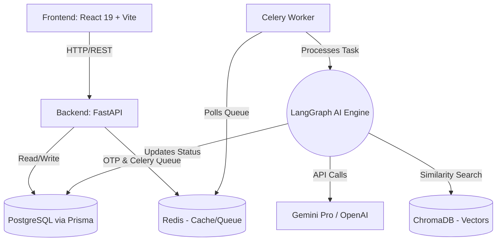

# System Design: Smart Complaint Analyzer

## 1. High-Level Architecture

The system follows a modern, decoupled asynchronous microservices-like architecture to handle the computationally heavy AI tasks without blocking the user interface.



## 2. Core Components

### 2.1 Frontend (React 19, Vite, Tailwind, Shadcn UI)
*   **Complaint Submission Flow:** A multi-step form (Details -> OTP -> Success) using React Hook Form and Zod for validation.
*   **Admin Dashboard:** Protected routes (via JWT) displaying real-time analytics (Recharts), ticket queues (TanStack Table), and manual override controls.
*   **State Management:** TanStack Query for server state and caching, Zustand for minimal client state.

### 2.2 Backend (FastAPI, Python)
*   **Endpoints:** RESTful API focusing on fast I/O.
*   **ORM:** Prisma Client Python for type-safe database access.
*   **Authentication:** Deferred auth. The first submission generates a ticket in `PENDING_OTP` state and sends an OTP (mocked/email) stored in Redis. Verifying OTP creates the user session (JWT) and pushes the task to Celery.

### 2.3 Task Queue (Celery & Redis)
*   **Broker:** Redis acts as the message broker for Celery.
*   **Tasks:** Primarily handles the `process_complaint_task(ticket_id)` which orchestrates the LangGraph execution.

### 2.4 AI Engine (LangGraph & LangChain)
A state graph with the following nodes:
1.  **Classification Node:** Determines the department (IT, Maintenance, Academic, etc.).
2.  **Priority Node:** Determines urgency (Low, Medium, High, Urgent) and sentiment.
3.  **Duplicate Check Node:** Embeds the complaint text and queries ChromaDB for similarities above a threshold.
4.  **Routing/Decision Node:** If confidence is high and no duplicate is found, routes to department. If low confidence or potential duplicate, routes to Admin Pending Queue.

### 2.5 Data Storage
*   **PostgreSQL:** Source of truth for Users, Organizations, Tickets, Departments, and Audit Logs.
*   **Redis:** Ephemeral storage for OTPs (5 min TTL) and Celery task queues.
*   **ChromaDB:** Vector database storing document embeddings of previous complaints to power the Duplicate Detection Agent.

## 3. Database Schema (Prisma)

```prisma
model Organization {
  id          String       @id @default(uuid())
  name        String
  departments Department[]
  users       User[]
  tickets     Ticket[]
}

model User {
  id             String       @id @default(uuid())
  email          String       @unique
  role           Role         @default(COMPLAINANT) // COMPLAINANT, ADMIN, DEPT_HEAD
  organizationId String
  organization   Organization @relation(fields: [organizationId], references: [id])
  tickets        Ticket[]
  createdAt      DateTime     @default(now())
}

model Department {
  id             String       @id @default(uuid())
  name           String       // e.g., "IT Support", "Maintenance"
  email          String
  organizationId String
  organization   Organization @relation(fields: [organizationId], references: [id])
  tickets        Ticket[]
}

model Ticket {
  id             String       @id @default(uuid())
  title          String
  description    String
  status         TicketStatus @default(PENDING_OTP) // PENDING_OTP, QUEUED, AI_PROCESSING, ROUTED, MANUAL_REVIEW, RESOLVED
  priority       Priority?    // LOW, MEDIUM, HIGH, URGENT
  sentiment      String?
  aiConfidence   Float?
  
  userId         String
  user           User         @relation(fields: [userId], references: [id])
  organizationId String
  organization   Organization @relation(fields: [organizationId], references: [id])
  departmentId   String?
  department     Department?  @relation(fields: [departmentId], references: [id])
  
  isDuplicateOf  String?      // References another Ticket ID
  
  createdAt      DateTime     @default(now())
  updatedAt      DateTime     @updatedAt
}

enum Role {
  COMPLAINANT
  ADMIN
  DEPT_HEAD
}

enum TicketStatus {
  PENDING_OTP
  QUEUED
  AI_PROCESSING
  ROUTED
  MANUAL_REVIEW
  RESOLVED
}

enum Priority {
  LOW
  MEDIUM
  HIGH
  URGENT
}
```

## 4. API Endpoints

### 4.1 Public & Auth
*   `POST /api/complaints/soft-submit`: Accepts complaint details, saves as `PENDING_OTP`, generates OTP, saves in Redis, sends email.
*   `POST /api/auth/verify-otp`: Accepts ticket ID and OTP. If valid, updates ticket status to `QUEUED`, creates/authenticates user, dispatches Celery task, returns JWT.

### 4.2 Tickets
*   `GET /api/tickets/{id}`: Polled by frontend for real-time status updates (or via WebSockets/SSE for better UX).
*   `GET /api/tickets`: For users to see their history, or admins to see all (filtered by role).

### 4.3 Admin
*   `GET /api/admin/analytics`: Aggregations for dashboard (word clouds, priority heatmaps).
*   `POST /api/admin/tickets/{id}/route`: Manual override to route a ticket to a specific department.

## 5. Implementation Strategy

### Phase 1: Foundation
*   Initialize Git repository.
*   Setup FastAPI backend structure with Prisma and PostgreSQL.
*   Setup React/Vite frontend with Shadcn UI and routing.

### Phase 2: Core Workflows (Non-AI)
*   Implement soft-submit and OTP verification (mocked email).
*   Setup JWT authentication.
*   Build basic UI for submission and dashboard framing.

### Phase 3: AI Engine Integration
*   Setup Celery and Redis.
*   Build LangGraph nodes (Classification, Priority).
*   Integrate ChromaDB for duplicate detection.
*   Connect the AI worker to the Postgres DB to update ticket status.

### Phase 4: Admin Dashboard & Polish
*   Build out analytics UI.
*   Implement manual override flows.
*   Apply final glassmorphism design touches and Framer Motion animations.
